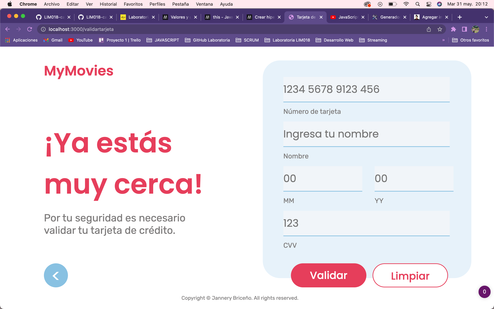
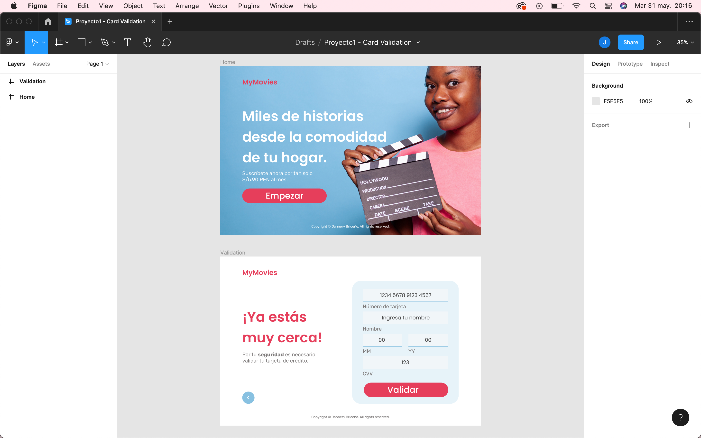

# Validación de trajeta en MyMovies

## Índice

* [1. Resumen](#1-resumen)
* [2. Imagen final del proyecto](#2-imagen-final-del-proyecto)
* [3. Investigación UX](#3-investigacion-UX)

***

## 1. Resumen

Aplicación web que le permite al usuario validar y enmascarar su número de tarjeta de crédito para acceder al catálogo de películas en MyMovies.

## 2. Imagen Final del proyecto

Las siguientes imágenes muestran el aplicativo web en un navegador:

## 3. Investigación UX

### Usuarios

Los usuarios de la aplicación son personas que disfrutan ver películas desde la comodidad de su hogar, sin embargo, quieren acceder al servicio de forma segura y quieren saber que sus datos son efectivamente válidos y ocultados. 

### Producto

La aplicación de MyMovies permite que los usuarios puedan validar su tarjeta de crédito y enmascarar esta a través de un formulario que les permite ingresar sus datos y un botón que permite realizar ambas funcionalidades. 

### Primer prototipo en papel

La siguiente imagen muestra el prototipo inicial del proyecto:
[PrototipoPapel1](PrototipoPapel1.heic)
[PrototipoPapel2](PrototipoPapel2.heic)

### Feedback

Reflexiona y luego marca los objetivos que has llegado a entender y aplicar en tu proyecto. Piensa en eso al decidir tu estrategia de trabajo.

### Imagen del prototipo final

La siguiente imagen es el prototipo final desarrollado en Figma:
