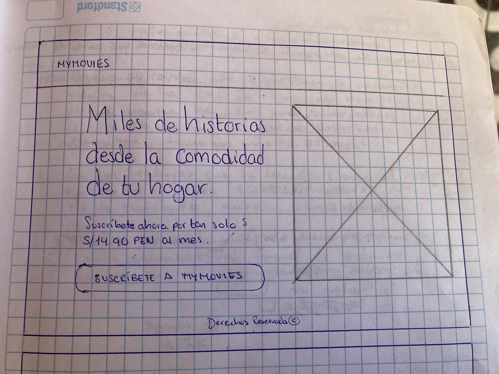
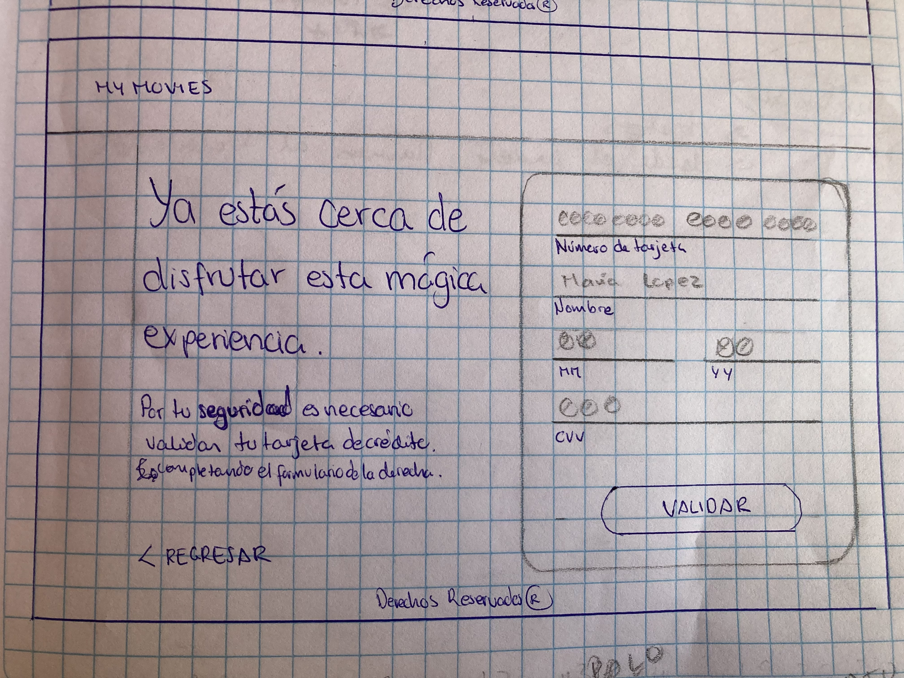

# Validación de tarjeta para MyMovies.com

## Índice

* [1. Resumen](#1-resumen)
* [2. Imagen final del proyecto](#2-imagen-final-del-proyecto)
* [3. Investigación UX](#3-investigación-UX)
* [4. Acceso al proyecto](#3-github-pages)

***

## 1. Resumen

Aplicación web que le permite al usuario validar y enmascarar su número de tarjeta de crédito para acceder al catálogo de películas en MyMovies.

## 2. Imagen Final del proyecto

Las siguientes imágenes muestran el aplicativo web en un navegador:

## 3. Investigación UX

### :bust_in_silhouette: Usuarios

Los usuarios de la aplicación son personas que disfrutan ver películas desde la comodidad de su hogar. Los usuarios de MyMovies.com desean acceder al servicio de forma segura y saber que sus datos son efectivamente válidos y ocultados. 

### :package: Producto

La aplicación de MyMovies permite que los usuarios puedan validar su tarjeta de crédito y enmascarar esta a través de un formulario que les permite ingresar sus datos y un botón que permite realizar ambas funcionalidades. 

### :pencil2: Primer prototipo en papel

La siguiente imagen muestra el prototipo inicial del proyecto:

### :computer: Imagen del prototipo final

La siguiente imagen es el prototipo final desarrollado en Figma:

### :hammer_and_wrench: Tecnologías utilizadas

* HTML
* CSS
* JavaScript

## 4. GitHub Pages

Acceda a la página web mediante el siguiente enlace: https://jannerymbf.github.io/LIM018-card-validation/